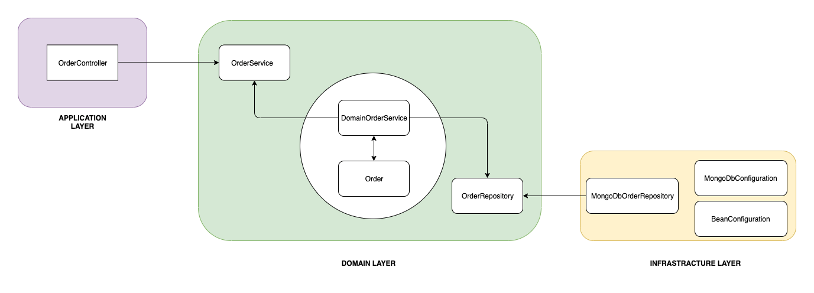

# ddd-golang-project

## How to run

### Local

Just run:

```sh
docker compose up
```

## All itens considered

With technical justification.

- docker-compose for development. Every single project should have it
- README.md with all information to maintain and run. Description about what it does
- Unit tests
- Integration tests
- Dockerfile with optimizations
- Database with optimizations
- REST with response headers
- commit messages using https://www.conventionalcommits.org/en/v1.0.0/
- Using slog
- Using Makefile
- launch.json for VSCode ready for debugging
- Save dates as UTC (and local?)
- Bruno endpoints
- REST API documentation

## Structure

```
my-ddd-app/
├── cmd/
│   └── main.go                # Main application entry point
├── internal/
│   ├── app/
│   │   ├── service.go         # Application service layer
│   │   └── errors.go          # Custom application-specific errors
│   ├── domain/
│   │   ├── user.go            # User domain entity
│   │   ├── task.go            # Task domain entity
│   │   └── repository.go      # Repository interfaces
│   ├── infrastructure/
│   │   ├── persistence/
│   │   │   ├── user_repository.go  # User repository implementation
│   │   │   ├── task_repository.go  # Task repository implementation
│   │   │   └── database.go         # Database connection setup
│   │   ├── messaging/
│   │   │   └── rabbitmq.go    # RabbitMQ integration
│   │   └── external/
│   │       └── weatherapi.go  # External weather API integration
|   ├── api/                   # here or inside of the app/
│   │   ├── handlers.go              
|   │   └── routes.go                
│   ├── config/
│   │   └── config.go          # Application configuration
│   ├── main.go                # Application initialization
├── migrations/
│   └── 20231007_init.sql      # Database schema migration script
├── config.yaml                # Configuration file
├── Dockerfile                 # Dockerfile for containerization
├── docker-compose.yml         # Docker Compose configuration
├── README.md                  # Project documentation
└── go.mod

```

## Introduction

1. `cmd/`: This directory contains the application's entry point (main.go), where you configure and start your application.

1. `internal/app/`: Defines the jobs the software is supposed to do and directs the expressive domain objects to work out problems. The tasks this layer is responsible for are meaningful to the business or necessary for interaction with the application layers of other systems. **This layer is kept thin**. It does not contain business rules or knowledge, but only coordinates tasks and delegates work to collaborations of domain objects in the next layer down. It does not have state reflecting the business situation, but it can have state that reflects the progress of a task for the user or the program.

1. `internal/domain/`: Responsible for representing concepts of the business, information about the business situation, and business rules. State that reflects the business situation is controlled and used here, even though the technical details of storing it are delegated to the infrastructure. This layer is the heart of business software.

1. `internal/infrastructure/`: Defines the jobs the software is supposed to do and directs the expressive domain objects to work out problems. The tasks this layer is responsible for are meaningful to the business or necessary for interaction with the application layers of other systems. **This layer is kept thin**. It does not contain business rules or knowledge, but only coordinates tasks and delegates work to collaborations of domain objects in the next layer down. It does not have state reflecting the business situation, but it can have state that reflects the progress of a task for the user or the program.
    - `persistence/` contains the concrete repository implementations (e.g., UserRepository and TaskRepository) that interact with the database.
    - `messaging/` includes integration code for RabbitMQ.
    - `external/` contains code for integrating with external services like the weather API.
1. `internal/config/`: This directory manages application configuration, including loading configuration settings from config.yaml.

With this structure, you maintain a clear separation of concerns between domain logic, application services, and infrastructure code. You can apply DDD principles to your domain entities, services, and repositories while keeping your codebase organized and easy to understand.

Dependencies in a DDD Service: the Application layer depends on Domain and Infrastructure, and Infrastructure depends on Domain, but Domain doesn't depend on any layer:

```
┌─────────────────────┐
│ Application layer   ├───────────┐
└─────────┬───────────┘           │
          │                       │
          │           ┌───────────▼─────────┐
          │           │ Domain model layer  │
          │           └───────────▲─────────┘
          │                       │
          │                       │
┌─────────▼────────────┐          │
│ Infrastructure layer ├──────────┘
└──────────────────────┘
```



### About `domain/repository.go`

The repository.go file typically defines repository interfaces for interacting with your domain entities, such as the User and Task entities. These interfaces provide a contract that concrete repository implementations must adhere to, allowing you to abstract the data access layer and facilitate testing and flexibility.

Each of the interfaces should be implemented by concrete repository implementations, which are responsible for interacting with the database or data store. These implementations will handle the specific database queries and operations required to fulfill the contract defined by the interfaces.

By defining repository interfaces and using them in your application, you decouple the business logic from the data access layer, making your code more modular and testable. Additionally, it allows you to switch between different data storage solutions (e.g., PostgreSQL, MySQL, NoSQL databases) with minimal code changes by implementing the same interfaces for each storage backend. 

### Domain vs Application: business logic

The business logic is primarily associated with the domain layer, but it can also exist in the application layer. The exact division between the two layers can vary depending on the architectural approach you choose and your application's specific requirements. Here's a more detailed explanation:

Domain Layer:
- The domain layer is the primary home for the core business logic of your application. It contains the domain entities (e.g., User and Task) and their associated behaviors and invariants.
- Business rules that are tightly related to the structure and behavior of domain entities should reside in this layer. For example, validation rules for ensuring that a task's due date is in the future or that a user's email address is unique within the system.
- The domain layer is focused on modeling the problem domain and maintaining the integrity of domain entities.

Application Layer:
- The application layer serves as an orchestrator of the domain logic. It contains use cases or services that coordinate the interactions between domain entities and enforce high-level business rules.
- Complex business workflows that involve multiple domain entities often reside in the application layer. For instance, the process of creating a task, checking user permissions, and notifying users about task updates can be orchestrated in the application layer.
- The application layer can also include cross-cutting concerns like logging, error handling, and transaction management.

## Reference

- https://learn.microsoft.com/en-us/dotnet/architecture/microservices/microservice-ddd-cqrs-patterns/ddd-oriented-microservice
- https://www.baeldung.com/hexagonal-architecture-ddd-spring
- https://github.com/ddd-crew/free-ddd-learning-resources
- https://threedots.tech/post/common-anti-patterns-in-go-web-applications/
- https://threedots.tech/post/things-to-know-about-dry/
- https://github.com/ThreeDotsLabs/wild-workouts-go-ddd-example